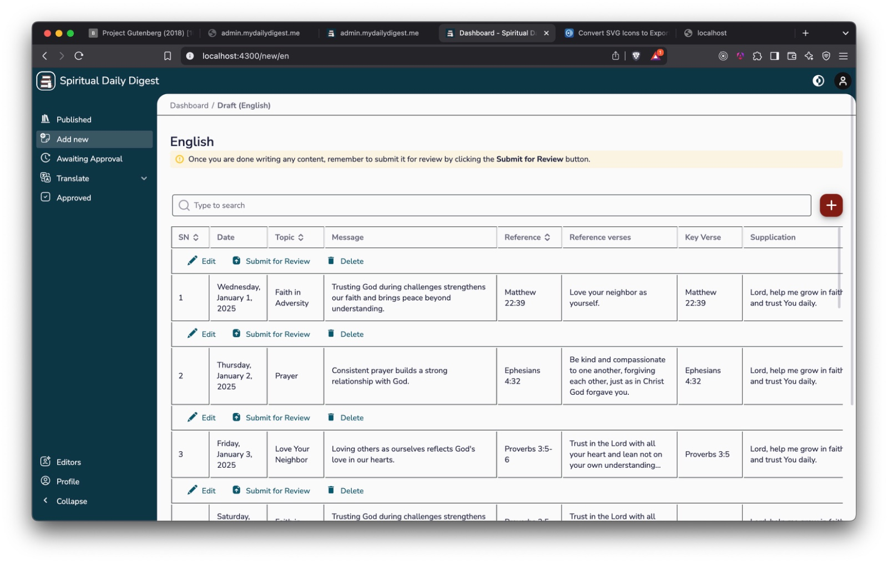
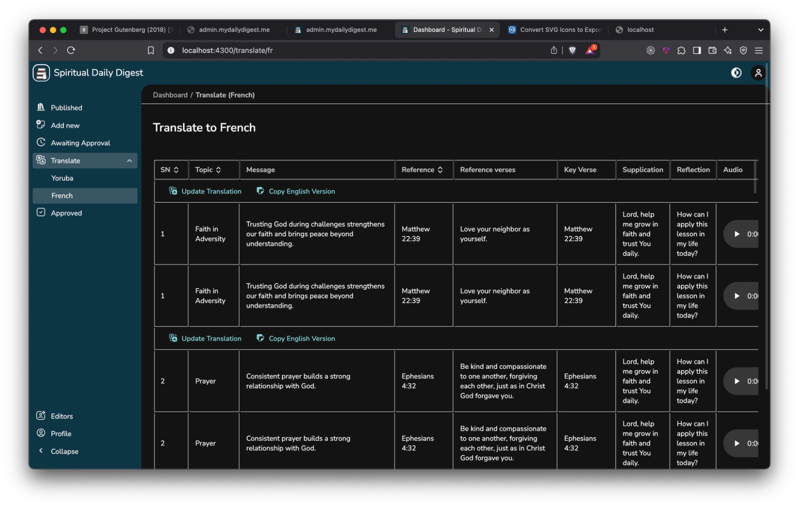
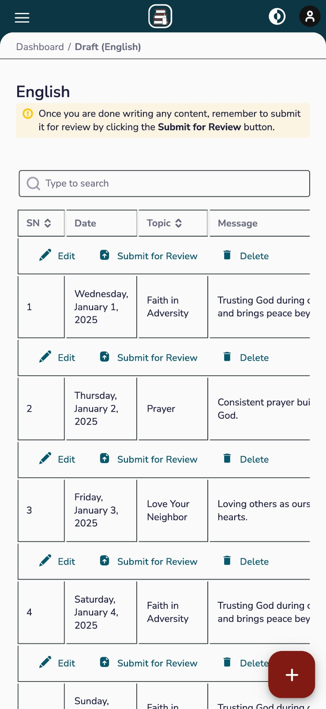

# My Daily Digest Content Management System

This project is a content management system (CMS) for My Daily Digest, built as a monorepo managed by Nx. It allows efficient development, sharing, and management of code across related projects within the CMS ecosystem.

## Overview

The project leverages Nx, a powerful toolkit designed for managing monorepos. This structure enables:

- **Code Sharing:** Easily share code between the writers and user-facing applications using common libraries.
- **Consistent Tooling:** Maintain consistent tooling, configurations, and build processes across the project.
- **Dependency Management:** Efficiently manage dependencies for all applications and libraries within the monorepo.
- **Streamlined Build and Test:** Easily run builds and tests for individual project parts or the entire project.

## Applications

This monorepo contains two main applications:

1.  **writers.mydailydigest.me:** This is the writersistrative panel for the My Daily Digest content management system. It's designed for:

    - **Content Management:** Creating, editing, publishing, and organizing content.
    - **Editor Management:** Managing the team of editors responsible for creating and curating content.
    - **User Management:** Overseeing user accounts and their access to the platform.

    - **dev version:** [http://dev-writers.mydailydigest.me](http://dev-writers.mydailydigest.me)
    - **prod version:** [http://writers.mydailydigest.me](http://writers.mydailydigest.me)

2.  **mydailydigest.me:** This is the end-user platform where readers can access and consume the content managed by the writers application. It focuses on providing a seamless reading experience.

    - **Live version of the project website:** [mydailydigest.me](mydailydigest.me)

## Libraries

The project includes three common libraries that facilitate code reuse and maintainability:

1.  **angular:** This library houses Angular-specific UI components, directives, and pipes. It's built to ensure a consistent user interface and experience across the applications.
2.  **core:** This library contains core utilities, models, and non-UI-related code. It's a collection of generic and reusable functions and data structures that can be used throughout the project.
3.  **mydailydigest:** This library encapsulates code specific to the My Daily Digest content domain. It includes shared code related to content structures, content processing, and other domain-specific features.

## Screenshots

### writers Application

#### Translate Screen



#### Draft Screen



#### Mobile Draft Screen



✨ Your new, shiny [Nx workspace](https://nx.dev) is ready ✨.

[Learn more about this workspace setup and its capabilities](https://nx.dev/getting-started/tutorials/angular-monorepo-tutorial?utm_source=nx_project&utm_medium=readme&utm_campaign=nx_projects) or run `npx nx graph` to visually explore what was created. Now, let's get you up to speed!

## Run tasks

To run the dev server for your app, use:

```sh
npx nx serve mydailydigest.me
```

To create a production bundle:

```sh
npx nx build mydailydigest.me
```

To see all available targets to run for a project, run:

```sh
npx nx show project mydailydigest.me
```

These targets are either [inferred automatically](https://nx.dev/concepts/inferred-tasks?utm_source=nx_project&utm_medium=readme&utm_campaign=nx_projects) or defined in the `project.json` or `package.json` files.

[More about running tasks in the docs &raquo;](https://nx.dev/features/run-tasks?utm_source=nx_project&utm_medium=readme&utm_campaign=nx_projects)

## Add new projects

While you could add new projects to your workspace manually, you might want to leverage [Nx plugins](https://nx.dev/concepts/nx-plugins?utm_source=nx_project&utm_medium=readme&utm_campaign=nx_projects) and their [code generation](https://nx.dev/features/generate-code?utm_source=nx_project&utm_medium=readme&utm_campaign=nx_projects) feature.

Use the plugin's generator to create new projects.

To generate a new application, use:

```sh
npx nx g @nx/angular:app demo
```

To generate a new library, use:

```sh
npx nx g @nx/angular:lib mylib
```

You can use `npx nx list` to get a list of installed plugins. Then, run `npx nx list <plugin-name>` to learn about more specific capabilities of a particular plugin. Alternatively, [install Nx Console](https://nx.dev/getting-started/editor-setup?utm_source=nx_project&utm_medium=readme&utm_campaign=nx_projects) to browse plugins and generators in your IDE.

[Learn more about Nx plugins &raquo;](https://nx.dev/concepts/nx-plugins?utm_source=nx_project&utm_medium=readme&utm_campaign=nx_projects) | [Browse the plugin registry &raquo;](https://nx.dev/plugin-registry?utm_source=nx_project&utm_medium=readme&utm_campaign=nx_projects)

## Set up CI!

### Step 1

To connect to Nx Cloud, run the following command:

```sh
npx nx connect
```

Connecting to Nx Cloud ensures a [fast and scalable CI](https://nx.dev/ci/intro/why-nx-cloud?utm_source=nx_project&utm_medium=readme&utm_campaign=nx_projects) pipeline. It includes features such as:

- [Remote caching](https://nx.dev/ci/features/remote-cache?utm_source=nx_project&utm_medium=readme&utm_campaign=nx_projects)
- [Task distribution across multiple machines](https://nx.dev/ci/features/distribute-task-execution?utm_source=nx_project&utm_medium=readme&utm_campaign=nx_projects)
- [Automated e2e test splitting](https://nx.dev/ci/features/split-e2e-tasks?utm_source=nx_project&utm_medium=readme&utm_campaign=nx_projects)
- [Task flakiness detection and rerunning](https://nx.dev/ci/features/flaky-tasks?utm_source=nx_project&utm_medium=readme&utm_campaign=nx_projects)

### Step 2

Use the following command to configure a CI workflow for your workspace:

```sh
npx nx g ci-workflow
```

[Learn more about Nx on CI](https://nx.dev/ci/intro/ci-with-nx#ready-get-started-with-your-provider?utm_source=nx_project&utm_medium=readme&utm_campaign=nx_projects)

## Install Nx Console

Nx Console is an editor extension that enriches your developer experience. It lets you run tasks, generate code, and improves code autocompletion in your IDE. It is available for VSCode and IntelliJ.

[Install Nx Console &raquo;](https://nx.dev/getting-started/editor-setup?utm_source=nx_project&utm_medium=readme&utm_campaign=nx_projects)

## Useful links

Learn more:

- [Learn more about this workspace setup](https://nx.dev/getting-started/tutorials/angular-monorepo-tutorial?utm_source=nx_project&utm_medium=readme&utm_campaign=nx_projects)
- [Learn about Nx on CI](https://nx.dev/ci/intro/ci-with-nx?utm_source=nx_project&utm_medium=readme&utm_campaign=nx_projects)
- [Releasing Packages with Nx release](https://nx.dev/features/manage-releases?utm_source=nx_project&utm_medium=readme&utm_campaign=nx_projects)
- [What are Nx plugins?](https://nx.dev/concepts/nx-plugins?utm_source=nx_project&utm_medium=readme&utm_campaign=nx_projects)

And join the Nx community:

- [Discord](https://go.nx.dev/community)
- [Follow us on X](https://twitter.com/nxdevtools) or [LinkedIn](https://www.linkedin.com/company/nrwl)
- [Our Youtube channel](https://www.youtube.com/@nxdevtools)
- [Our blog](https://nx.dev/blog?utm_source=nx_project&utm_medium=readme&utm_campaign=nx_projects)
